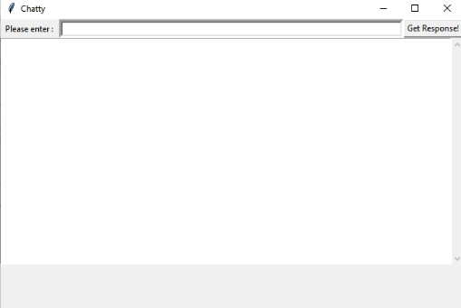

# chatty_v1
A simple chatbot using nltk.

First of all, thanks to Parul pandey for letting me use her code.
All the theoritical concepts are explained beautifully in this medium article written by Parul Pandey.
https://medium.com/analytics-vidhya/building-a-simple-chatbot-in-python-using-nltk-7c8c8215ac6e
This bot can only answer preliminary questions. It might not give sophisticated replies. It can also nonsensical replies.
This bot is designed on the topic chatbots. Change the content of content.py file to make the chatbot converse about different topic.

Working:
Actual GUI of chatty

Please enter the message and click on Get Response Button to get the reply from the bot.
